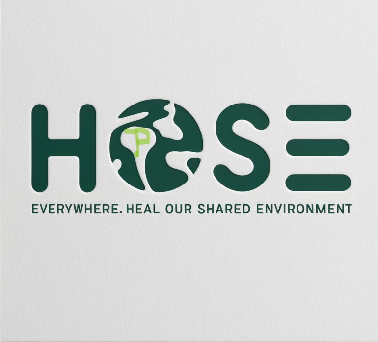

# HOSE Green 🌍
<div align="center">
  
  
  <h3>Heal Our Shared Environment</h3>
  <p>Making environmental action accessible, engaging, and rewarding</p>
</div>

## Inspiration
_```Every minute, we lose forest area equivalent to 40 football fields. By 2050, there could be more plastic than fish in our oceans🥺```_

**[HOSE Green](https://ujpm.github.io/HOSE-Green/)** was inspired by the urgent need for collective action against environmental degradation. Witnessing the alarming statistics of deforestation, pollution, and climate change, I realized that while awareness is growing, the gap between knowledge and action remains vast. Our mission is to empower individuals and communities to take meaningful steps toward sustainability, transforming concern into action.

> **HOSE** in Kinyarwanda means **Everywhere**  
> **HOSE** in full = **_Heal Our Shared Environment_**

## Features 🌟

<div align="center">
  
</div>

HOSE Green is a comprehensive platform that connects eco-conscious individuals with environmental campaigns, communities, and rewards. It allows users to:
- 🌱 Join or create impactful environmental campaigns
- 👥 Connect with like-minded individuals in their communities
- 🎯 Earn rewards for positive environmental actions
- 📚 Access resources and knowledge to enhance environmental efforts

**[```Try it here```](https://ujpm.github.io/HOSE-Green/)**

## Tech Stack 💻

<div align="center">
  
  
  
  
</div>

I built HOSE Green using a combination of modern web technologies:
- **Frontend**: HTML5, CSS3, and JavaScript
- **UI Framework**: Bootstrap 5 for responsive design
- **Animations**: AOS (Animate On Scroll)
- **Backend**: To be enhanced
- **APIs**: To be integrated

## Project Screenshots 📸

<div align="center">
  
  
</div>

## Challenges and Solutions 🎯

| Challenge | Solution |
|-----------|----------|
| User Engagement | Implemented gamified rewards system |
| Technical Integration | Modular architecture for future scaling |
| Community Building | Created intuitive social features |

## Roadmap 🗺️

- [ ] Enhanced user authentication
- [ ] Mobile application development
- [ ] Integration with environmental APIs
- [ ] Community forum implementation
- [ ] Advanced rewards system

## Contributing 🤝

Contributions are welcome! Please feel free to submit a Pull Request. For major changes, please open an issue first to discuss what you would like to change.

## License 📄

This project is licensed under the MIT License - see the [LICENSE](LICENSE) file for details.

## Contact 📬

- 🌐 **[MY WEBSITE](https://portifolio-cgu.pages.dev)**
- linkedin: **[My Linkedin](https://www.linkedin.com/in/ujeanpierre45/)**
- Twitter: **[twitter](https://x.com/Uwizeyi30479056)**
- Email: uwizeyimanajp2@gmail.com

<div align="center">
  <p>Made with 💚 for the environment</p>
</div>
